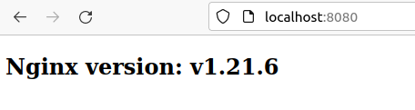
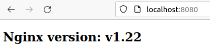
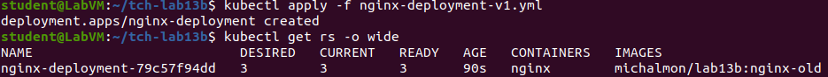
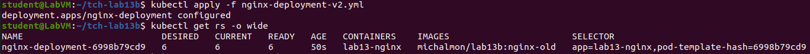
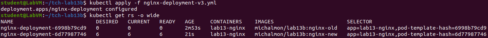
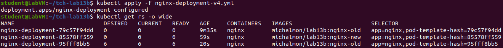
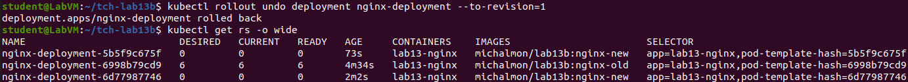

<h1>Technologie Chmurowe - Laboratorium 13B</h1>
<h2>Autor: Michał Moń</h2>
<h3>Opis repozytorium:</h3>
W repozytorium znajdują się foldery <b>nginx-old</b> oraz <b>nginx-new</b>, które zawierają pliki Dockerfile oraz index.html służące do zbudowania obrazów <b>"nginx-old"</b> oraz <b>"nginx-new"</b>, które zostały wypchnięte do repozytorium Dockerhub (<a href="">Link</a>). Obrazy te bazują na "klasycznym" obrazie serwera "nginx", jednakże domyślny plik "index.html" widoczny po uruchomieniu został zastąpiony własnym plikiem <b>"index.html"</b>, który wyświetla wersję aktualnie uruchomionego serwera "nginx".  
Ponadto zostały przygotowane 4 pliki <b>nginx-deployment-v1/v2/v3/v4.yml</b>, każdy z nich realizuje kolejny z etapów założonych w zadaniu:
<ul>
  <li><b>nginx-deployment-v1.yml</b> - wdrożenie usługi, liczba replik: 3, obraz: nginx-old</li>
  <li><b>nginx-deployment-v2.yml</b> - zwiększenie liczby replik, liczba replik: 6, obraz: nginx-old</li>
  <li><b>nginx-deployment-v3.yml</b> - zmiana obrazu na <b>nginx-new</b>, liczba replik: 6, obraz: nginx-new </li>
  <li><b>nginx-deployment-v4.yml</b> - ustawienie limitów zasobów, liczba replik: 6, obraz: nginx-new</li>
</ul>
<h3>Test działania zbudowanych obrazów:</h3>
<h4>nginx-old</h4>

<h4>nginx-new</h4>

<h3>Wykonanie zadania:</h3>
<ol>
  <li>
    Wdrożenie usługi z użyciem polecenia <b>kubectl apply -f nginx-deployment-v1.yml</b> oraz wykonanie polecenia
    <b>kubectl get rs -o wide</b> w celu sprawdzenia poprawności wdrożenia usługi.  
     
  </li>
  <li>
    Wdrożenie kolejnej wersji usługi i zwiększenie liczby replik do 6. Po wykonaniu polecenia <b>kubectl get rs -o wide</b> można zauważyć, że poprzednie Pody nie zostały zabite, zwiększyła się jedynie liczba replik już istniejącego Poda.   
     
  </li>
  <li>
    Wdrożenie kolejnej wersji usługi, obraz <b>nginx-old</b> został zamieniony na <b>nginx-new</b>, co spowodowało zabicie
    poprzednich Podów i stworzenie nowej wersji ReplicaSet, co można zaobserwować po wykonaniu polecenia <b>kubectl get rs -o wide</b>  
     
  </li>
  <li>
    Wdrożenie finalnej wersji usługi oraz ustawienie limitów zasobów. Po wykonaniu polecenia <b>kubectl get rs -o wide</b>  widać, że ponownie spowodowało to zabicie poprzednich Podów i stworzenie nowej wersji ReplicaSet, tym razem jednak z limitami CPU oraz MEMORY.   
  </li>
  <li>Wykonanie rollback (downgrade) z powrotem do pierwszej wersji usługi z użyciem polecenia <b>kubectl rollout undo deployment nginx-deployment --to-revision=1</b>. Spowodowało to zabicie Podów pracujących na bazie obrazu <b>nginx-new</b> oraz odtworzenie tych, które pracowały na bazie obrazu <b>nginx-old</b>   </li>
</ol>
